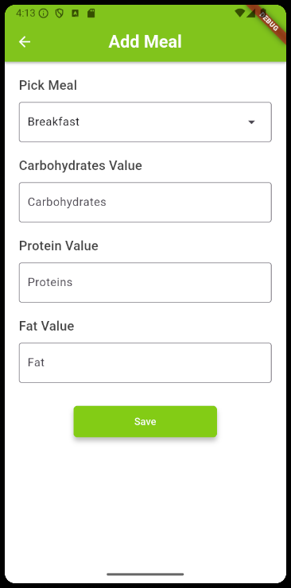

# NutriCoach

&nbsp;&nbsp;&nbsp;&nbsp;&nbsp;&nbsp;NutriCoach is a mobile application that is designed to help athletes manage their daily nutrition based on their training intensity, ensuring they meet their nutritional needs for optimal performance. Developed a dynamic and responsive frontend using Flutter, and Express.js to ensure performance and flexibility. MySQL is used for efficient data storage. To ensure the quality and reliability of the code, I use Postman, Sinon, Supertest, Chai, and Mocha for testing. 

## Tools & Technologies
* Frontend - [Flutter](https://flutter.dev/)
* Backend - [Express.js](https://expressjs.com/)
* Containerization - [Docker](https://www.docker.com/), [Docker Compose](https://docs.docker.com/compose/)
* Database - [MySQL](https://www.mysql.com/)
* API Testing - [Postman](https://www.postman.com/)

## UI

 

 

